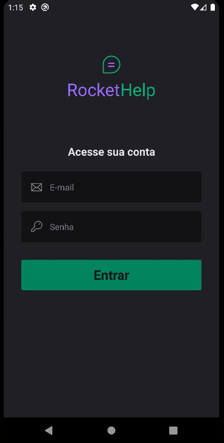

<h1 align="center">
   
</h1>
 

  <a href="#-projeto">Project</a>&nbsp;&nbsp;&nbsp;|&nbsp;&nbsp;&nbsp;
  <a href="#-tecnologias">Technologies</a>&nbsp;&nbsp;&nbsp;|&nbsp;&nbsp;&nbsp;
  <a href="#-usage">Usage</a>&nbsp;&nbsp;&nbsp;|&nbsp;&nbsp;&nbsp;
  <a href="#-participants">Participants</a>

 

## 💻 Project

🔊 RocketHelp was an app made with React Native using Expo. In the application you can create service requests, track and complete open requests... It was developed during @Rocketseat IgniteLab... 💜

    

## 🚀 Technologies

This project was developed with the following technologies:

- [React Native](https://reactnative.dev/)
- [Expo](https://expo.dev/)
- [Firebase](https://firebase.google.com/)
- [Typescript](https://www.typescriptlang.org/)
- [NativeBase](https://nativebase.io/)

## 💻 Usage

 ### App
    
    $ if you want to test you need to create a firebase project 

    $ create an android app and put the google-services.json file on the src folder

    $ create an ios app and put the GoogleService-Info.plist file on the src folder

    $ run yarn

    $ run expo prebuild.
    
    $ yarn start

    $ Important: run on emulator
    

## 👥 Participants

[Samuel Formigheri](https://github.com/SamuelFormigheri)